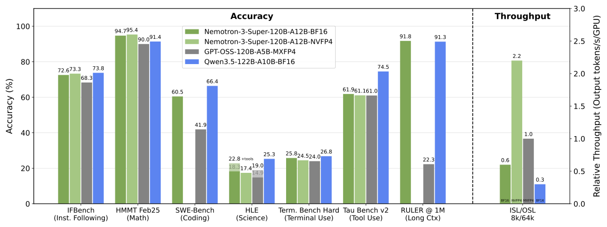

# NVIDIA-Nemotron-3-Super-120B-A12B-NVFP4

<div align="center" style="line-height: 1;">
<a href="https://build.nvidia.com/nvidia/nemotron-3-super-120b-a12b" target="_blank" style="margin: 2px;">
    
</a>
<a href="https://research.nvidia.com/labs/nemotron/files/NVIDIA-Nemotron-3-Super-Technical-Report.pdf" target="_blank" style="margin: 2px;">
    
</a>
<a href="https://huggingface.co/collections/nvidia/nemotron-pre-training-datasets" target="_blank" style="margin: 2px;">
    
</a>
<a href="https://huggingface.co/collections/nvidia/nemotron-post-training-v3" target="_blank" style="margin: 2px;">
    
</a>
</div>
<div align="center" style="line-height: 1;">
  <a href="https://developer.nvidia.com/nemotron" target="_blank" style="margin: 2px;">
    
  </a>
<a href="https://discord.gg/9xpKQtVvrk" target="_blank" style="margin: 2px;">
    
  </a>
</div>

<div align="center" style="line-height: 1;">
  <a href="https://www.nvidia.com/en-us/agreements/enterprise-software/nvidia-nemotron-open-model-license/" style="margin: 2px;">
    
  </a>
</div>



## Model Summary

| | |
|:---|:---|
| **Total Parameters** | 120B (12B active) |
| **Architecture** | LatentMoE - Mamba-2 + MoE + Attention hybrid with Multi-Token Prediction (MTP) |
| **Context Length** | Up to 1M tokens |
| **Minimum GPU Requirement** | 1× B200-80GB OR 1× DGX Spark|
| **Supported Languages** | English, French, German, Italian, Japanese, Spanish, Chinese |
| **Best For** | Agentic workflows, long-context reasoning, high-volume workloads (e.g. IT ticket automation), tool use, RAG |
| **Reasoning Mode** | Configurable on/off via chat template (`enable_thinking=True/False`) |
| **License** | [NVIDIA Nemotron Open Model License](https://www.nvidia.com/en-us/agreements/enterprise-software/nvidia-nemotron-open-model-license/) |
| **Release Date** | March 11, 2026 |


## Quick Start

> Use `temperature=1.0` and `top_p=0.95` across **all tasks and serving backends** — reasoning, tool calling, and general chat alike.

For more details on how to deploy and use the model - see the [Quick Start Guide](#quick-start-guide) below!

## Model Overview

**Model Developer:** NVIDIA Corporation

**Model Dates:** December 2025 - March 2026

**Data Freshness:**

* The post-training data has a cutoff date of February 2026.
* The pre-training data has a cutoff date of June 2025.

### What is Nemotron?

NVIDIA Nemotron™ is a family of open models with open weights, training data, and recipes, delivering leading efficiency and accuracy for building specialized AI agents.

## Description

**Nemotron-3-Super-120B-A12B-NVFP4** is a large language model (LLM) trained by NVIDIA, designed to deliver strong agentic, reasoning, and conversational capabilities. It is optimized for collaborative agents and high-volume workloads such as IT ticket automation. Like other models in the family, it responds to user queries and tasks by first generating a reasoning trace and then concluding with a final response. The model's reasoning capabilities can be configured through a flag in the chat template.

The model employs a hybrid **Latent Mixture-of-Experts (LatentMoE)** architecture, utilizing interleaved Mamba-2 and MoE layers, along with select Attention layers. Distinct from the Nano model, the Super model incorporates **Multi-Token Prediction (MTP)** layers for faster text generation and improved quality, and it is trained using **NVFP4** quantization to maximize compute efficiency. The model has **12B active parameters** and **120B parameters in total**.

The supported languages include: English, French, German, Italian, Japanese, Spanish, and Chinese

This model is ready for commercial use.

## License/Terms of Use

**Governing Download Terms:** Use of this model is governed by the [NVIDIA Nemotron Open Model License](https://www.nvidia.com/en-us/agreements/enterprise-software/nvidia-nemotron-open-model-license/).

**Governing Download Terms with NIM:** The NIM container is governed by the [NVIDIA Software License Agreement](https://www.nvidia.com/en-us/agreements/enterprise-software/nvidia-software-license-agreement/) and [Product-Specific Terms for AI Products](https://www.nvidia.com/en-us/agreements/enterprise-software/product-specific-terms-for-ai-products/). Use of this model is governed by the [NVIDIA Nemotron Open Model License](https://www.nvidia.com/en-us/agreements/enterprise-software/nvidia-nemotron-open-model-license/).

### Benchmarks 

| Benchmark | Nemotron-3-Super | Nemotron-3-Super FP8 | Nemotron-3-Super NVFP4 |
|---|---|---|---|
| **General Knowledge** | | | |
| MMLU-Pro | 83.73 | 83.63 | 83.33 |
| **Reasoning** | | | |
| HMMT Feb25 (with tools) | 94.73 | 94.38 | 95.36 |
| GPQA (no tools) | 79.23 | 79.36 | 79.42 |
| LiveCodeBench (v6 2024-08↔2025-05) | 78.69 | 78.44 | 78.44 |
| LiveCodeBench (v5 2024-07↔2024-12) | 81.19 | 80.99 | 80.56 |
| SciCode (subtask) | 42.05 | 41.38 | 40.83 |
| HLE (no tools) | 18.26 | 17.42 | 17.42 |
| **Agentic** | | | |
| Terminal Bench (hard subset) | 25.78 | 26.04 | 24.48 |
| **TauBench V2** | | | |
|   Airline | 56.25 | 56.25 | 54.75 |
|   Retail | 62.83 | 63.05 | 63.38 |
|   Telecom | 64.36 | 63.93 | 63.27 |
|   Average | 61.15 | 61.07 | 60.46 |
| **Chat & Instruction Following** | | | |
| IFBench (prompt) | 72.58 | 72.32 | 73.30 |
| Scale AI Multi-Challenge | 55.23 | 54.35 | 52.8 |
| Arena-Hard-V2 (Hard Prompt) | 73.88 | 76.06 | 76.00 |
| **Long Context** | | | |
| AA-LCR | 58.31 | 57.69 | 58.06 |
| RULER-500 @ 128k (500 samples per task) | 96.79 | 96.85 | 95.99 |
| RULER-500 @ 256k (500 samples per task) | 96.60 | 96.33 | 96.52 |
| RULER-500 @ 512k (500 samples per task) | 96.09 | 95.66 | 96.23 |
| **Multilingual** | | | |
| MMLU-ProX (avg over languages) | 79.35 | 79.21 | 79.37 |


All evaluation results were collected via [Nemo Evaluator SDK](https://github.com/NVIDIA-NeMo/Evaluator) and for most benchmarks, the [Nemo Skills Harness](https://github.com/NVIDIA-NeMo/Skills). For reproducibility purposes, more details on the evaluation settings can be found in the [Nemo Evaluator SDK configs folder](https://github.com/NVIDIA-NeMo/Evaluator/tree/main/packages/nemo-evaluator-launcher/examples/nemotron/nemotron-3-super) and the [reproducibility tutorial for Nemotron 3 Super](https://github.com/NVIDIA-NeMo/Evaluator/blob/main/packages/nemo-evaluator-launcher/examples/nemotron/nemotron-3-super/reproducibility.md). The open source container on Nemo Skills packaged via NVIDIA's Nemo Evaluator SDK used for evaluations can be found [here](https://catalog.ngc.nvidia.com/orgs/nvidia/teams/eval-factory/containers/nemo_skills). In addition to Nemo Skills, the evaluations also used dedicated open-source packaged containers for Tau-2 Bench (default prompt), Terminal Bench Hard (48 tasks), ScaleAI Multi Challenge Multi-turn Instruction Following, and Ruler. 

The following benchmarks are not onboarded yet in our open source tools and for these we used either their official open source implementation or otherwise an internal scaffolding that we plan to open source in the future: SWE Bench Verified (OpenHands), SWE Bench Multilingual (OpenHands), BrowseComp with Search (internal implementation with Serp API), Terminal Bench Core 2.0 (Harbor).

### Deployment Geography: Global

### Use Case

NVIDIA-Nemotron-3-Super-120B-A12B-NVFP4 is a general purpose reasoning and chat model intended to be used in English, Code, and supported multilingual contexts. This model is optimized for collaborative agents and high-volume workloads. It is intended to be used by developers designing AI Agent systems, chatbots, RAG systems, and other AI-powered applications. This model is also suitable for complex instruction-following tasks and long-context reasoning.

### Release Date

Hugging Face - 03/11/2026 via [Hugging Face](https://huggingface.co/collections/nvidia/NVIDIA-Nemotron-3-Super-120B-A12B-NVFP4)

## Reference(s)

* [NVIDIA Nemotron 3 model family on Hugging Face](https://huggingface.co/collections/nvidia/nvidia-nemotron-v3)
* [NVIDIA Nemotron 3 Super Technical Report](https://research.nvidia.com/labs/nemotron/files/NVIDIA-Nemotron-3-Super-Technical-Report.pdf)

## Model Architecture

- **Architecture Type:** Mamba2-Transformer Hybrid Latent Mixture of Experts (LatentMoE) with Multi-Token Prediction (MTP)
- **Network Architecture:** Nemotron Hybrid LatentMoE
- **Number of model parameters:** 120B Total / 12B Active

## Model Design

The model utilizes the **LatentMoE** architecture, where tokens are projected into a smaller latent dimension for expert routing and computation, improving accuracy per byte. The Super model is pre-trained using NVFP4 quantization — the first model in the Nemotron 3 family trained at this precision. The majority of linear layers use NVFP4 for weights, activations, and gradients, while select layers (including latent projections, MTP layers, QKV/attention projections, and embeddings) are maintained in BF16 or MXFP8 for training stability. The model includes **Multi-Token Prediction (MTP)** layers using a shared-weight design across prediction heads. This improves training signal quality, enables faster inference via native speculative decoding, and supports more stable autoregressive drafting at longer draft lengths compared to independently trained offset heads.

## Training Methodology

Stage 1: Pre-Training

* [NVIDIA-Nemotron-3-Super-120B-A12B-Base-BF16](https://huggingface.co/collections/nvidia/NVIDIA-Nemotron-3-Super-120B-A12B-Base-BF16) model was pre-trained for over 25T tokens using crawled and synthetic code, math, science, and general knowledge data. Training leveraged NVFP4 quantization for efficiency. All datasets are disclosed in the [Training and Evaluation Datasets](https://huggingface.co/nvidia/NVIDIA-Nemotron-3-Super-120B-A12B-NVFP4#training-and-evaluation-datasets) section of this document. Major portions of the pre-training corpus are released in the [Nemotron-Pre-Training-Datasets](https://huggingface.co/collections/nvidia/nemotron-pre-training-datasets) collection.
* Software used for pre-training: [Megatron-LM](https://github.com/NVIDIA/Megatron-LM)

Stage 2: Supervised Fine-Tuning

* The model was further fine-tuned on synthetic code, math, science, tool calling, instruction following, structured outputs, and general knowledge data. This stage incorporated data designed to support long-range retrieval and multi-document aggregation. All datasets are disclosed in the [Training and Evaluation Datasets](https://huggingface.co/nvidia/NVIDIA-Nemotron-3-Super-120B-A12B-NVFP4#training-and-evaluation-datasets) section of this document. Major portions of the fine-tuning corpus are released in the [Nemotron-Post-Training-v3](https://huggingface.co/collections/nvidia/nemotron-post-training-v3) collection. [Data Designer](https://github.com/NVIDIA-NeMo/DataDesigner) is one of the libraries used to prepare these corpora.

Stage 3: Reinforcement Learning

* The model underwent multi-environment reinforcement learning using asynchronous GRPO (Group Relative Policy Optimization) across math, code, science, instruction following, multi-step tool use, multi-turn conversations, and structured output environments. It utilized an asynchronous RL architecture that fully decouples training from inference across separate GPU devices, leveraging in-flight weight updates and MTP to accelerate rollout generation. Conversational quality was further refined through RLHF. All datasets are disclosed in the *Training and Evaluation Datasets* section of this document. The RL environments and datasets are released as part of [NeMo Gym](https://github.com/NVIDIA-NeMo/Gym).
* Software used for reinforcement learning: [NeMo RL](https://github.com/NVIDIA-NeMo/RL), [NeMo Gym](https://github.com/NVIDIA-NeMo/Gym)

NVIDIA-Nemotron-3-Super-120B-A12B-NVFP4 model is a result of the above work.

The end-to-end training recipe is available in the [NVIDIA Nemotron Developer Repository](https://github.com/NVIDIA-NeMo/Nemotron). Evaluation results can be replicated using the [NeMo Evaluator SDK](https://github.com/NVIDIA-NeMo/Evaluator). [Data Designer](https://github.com/NVIDIA-NeMo/DataDesigner) is one of the libraries used to prepare the pre and post training datasets. More details on the datasets and synthetic data generation methods can be found in the technical report [NVIDIA Nemotron 3 Super Technical Report](https://research.nvidia.com/labs/nemotron/files/NVIDIA-Nemotron-3-Super-Technical-Report.pdf).

## Input

- **Input Type(s):** Text
- **Input Format(s):** String
- **Input Parameters:** One-Dimensional (1D): Sequences
- **Other Properties Related to Input:** Maximum context length up to 1M tokens. Supported languages include: English, French, German, Italian, Japanese, Spanish, and Chinese

## Output

- **Output Type(s):** Text
- **Output Format:** String
- **Output Parameters:** One-Dimensional (1D): Sequences
- **Other Properties Related to Output:** Maximum context length up to 1M tokens

Our AI models are designed and optimized to run on NVIDIA GPU-accelerated systems. By leveraging NVIDIA's hardware (e.g. GPU cores) and software frameworks (e.g., CUDA libraries), the model achieves faster training and inference times compared to CPU-only solutions.

## Software Integration

- Runtime Engine(s): NeMo 25.11.01
- Supported Hardware Microarchitecture Compatibility: NVIDIA Ampere - A100; NVIDIA Blackwell; NVIDIA Hopper - H100-80GB
- Operating System(s): Linux

The integration of foundation and fine-tuned models into AI systems requires additional testing using use-case-specific data to ensure safe and effective deployment. Following the V-model methodology, iterative testing and validation at both unit and system levels are essential to mitigate risks, meet technical and functional requirements, and ensure compliance with safety and ethical standards before deployment.

## Model Version(s)

* v1.0 - GA

## Quick Start Guide

For each inference backend - we'll be using the custom `super_v3` reasoning parser - which you can obtain by following these instructions: 

```bash
wget https://huggingface.co/nvidia/NVIDIA-Nemotron-3-Super-120B-A12B-NVFP4/raw/main/super_v3_reasoning_parser.py
```

For advanced deployment configurations - visit [this resource](https://github.com/NVIDIA-NeMo/Nemotron/tree/main/usage-cookbook/Nemotron-3-Super/AdvancedDeploymentGuide)

#### vLLM

For more detailed information, please see [this cookbook](https://github.com/NVIDIA-NeMo/Nemotron/blob/main/usage-cookbook/Nemotron-3-Super/vllm_cookbook.ipynb).

```bash
pip install -U vllm --extra-index-url https://wheels.vllm.ai/097eb544e9a22810c9b7a59e586b61627b308362

export MODEL_CKPT=PATH/TO/MODEL/CHECKPOINT
```

```bash
vllm serve $MODEL_CKPT \
  --async-scheduling \
  --served-model-name nvidia/nemotron-3-super \
  --dtype auto \
  --kv-cache-dtype fp8 \
  --tensor-parallel-size 1 \
  --pipeline-parallel-size 1 \
  --data-parallel-size 1 \
  --swap-space 0 \
  --trust-remote-code \
  --attention-backend TRITON_ATTN \
  --gpu-memory-utilization 0.9 \
  --enable-chunked-prefill \
  --max-num-seqs 512 \
  --host 0.0.0.0 \
  --port 5000 \
  --enable-auto-tool-choice \
  --tool-call-parser qwen3_coder \
  --reasoning-parser-plugin "./super_v3_reasoning_parser.py" \
  --reasoning-parser super_v3
```

> Context length defaults to 256k above. To use up to 1M, set `VLLM_ALLOW_LONG_MAX_MODEL_LEN=1` and `--max-model-len 1M`

#### SGLang

Container:

```bash
docker pull lmsysorg/sglang:v0.5.9
```

Or `pip`:

```bash
pip install 'git+https://github.com/sgl-project/sglang.git#subdirectory=python'
```

For more detailed information, please see [this cookbook](https://github.com/NVIDIA-NeMo/Nemotron/blob/main/usage-cookbook/Nemotron-3-Super/sglang_cookbook.ipynb).

```bash
python3 -m sglang.launch_server \
  --model PATH/TO/CHECKPOINT \
  --served-model-name nvidia/nemotron-3-super \
  --host 0.0.0.0 \
  --port 5000 \
  --log-level warning \
  --trust-remote-code \
  --tp 1 \
  --ep 1 \
  --tool-call-parser qwen3_coder \
  --reasoning-parser nano_v3
```

> Context length defaults to 256k above. To use up to 1M, set `SGLANG_ALLOW_OVERWRITE_LONGER_CONTEXT_LEN=1` and `--context-length 1048576`

### API Client

The examples below use the OpenAI-compatible client and work with any of the serving backends above.

> NOTE: For coding agents add the following to the API call - `extra_body={“chat_template_kwargs”: {“force_nonempty_content”: True}`

```python
from openai import OpenAI
client = OpenAI(base_url="http://localhost:8000/v1", api_key="EMPTY")
MODEL = "nvidia/nemotron-3-super"
```

**Reasoning ON (default)**

```python
response = client.chat.completions.create(
    model=MODEL,
    messages=[{"role": "user", "content": "Write a haiku about GPUs"}],
    max_tokens=16000,
    temperature=1.0,
    top_p=0.95,
    extra_body={"chat_template_kwargs": {"enable_thinking": True}}
)
print(response.choices[0].message.content)
```

**Reasoning OFF**

```python
response = client.chat.completions.create(
    model=MODEL,
    messages=[{"role": "user", "content": "What is the capital of Japan?"}],
    max_tokens=16000,
    temperature=1.0,
    top_p=0.95,
    extra_body={"chat_template_kwargs": {"enable_thinking": False}}
)
print(response.choices[0].message.content)
```

**Low-effort reasoning**

Uses significantly fewer reasoning tokens than full thinking mode. Recommended as a starting point before tuning explicit token budgets.

```python
response = client.chat.completions.create(
    model=MODEL,
    messages=[{"role": "user", "content": "What is the capital of Japan?"}],
    max_tokens=16000,
    temperature=1.0,
    top_p=0.95,
    extra_body={"chat_template_kwargs": {"enable_thinking": True, "low_effort": True}}
)
print(response.choices[0].message.content)
```

### OpenCode

[OpenCode](https://opencode.ai/docs) is an AI coding agent that runs in your terminal. It connects to any OpenAI-compatible endpoint, making it compatible with all three serving backends above (vLLM, SGLang, and TRT-LLM).

Create or update your `~/.config/opencode/opencode.json`:

```json
{
    "$schema": "https://opencode.ai/config.json",
    "model": "local/nvidia-nemotron-3-super",
    "provider": {
        "local": {
            "npm": "@ai-sdk/openai-compatible",
            "name": "local_backend",
            "options": {
                "baseURL": "http://localhost:8000/v1",
                "apiKey": "EMPTY"
            },
            "models": {
                "nvidia-nemotron-3-super": {
                    "name": "nvidia/nemotron-3-super",
                    "limit": {
                        "context": 1000000,
                        "output": 32768
                    }
                }
            }
        }
    },
    "agent": {
        "build": {
            "temperature": 1.0,
            "top_p": 0.95,
            "max_tokens": 32000
        },
        "plan": {
            "temperature": 1.0,
            "top_p": 0.95,
            "max_tokens": 32000
        }
    }
}
```

> Update `baseURL` to match whichever backend you are running. The default port above (`8000`) matches the vLLM example; SGLang and TRT-LLM use `30000` and `8123` respectively.

To learn more about other supported agent scaffolds - check out [this resource](https://github.com/NVIDIA-NeMo/Nemotron/tree/main/usage-cookbook/Nemotron-3-Super/OpenScaffoldingResources)

<details>
<summary><strong> Advanced: Budget-Controlled Reasoning</strong></summary>

Set a hard token ceiling on the reasoning trace using `reasoning_budget`. The model will attempt to close the trace at the next newline before the budget is hit; if none is found within 500 tokens it closes abruptly at `reasoning_budget + 500`.

```python
from typing import Any, Dict, List
import openai
from transformers import AutoTokenizer


class ThinkingBudgetClient:
    def __init__(self, base_url: str, api_key: str, tokenizer_name_or_path: str):
        self.tokenizer = AutoTokenizer.from_pretrained(tokenizer_name_or_path)
        self.client = openai.OpenAI(base_url=base_url, api_key=api_key)

    def chat_completion(
        self,
        model: str,
        messages: List[Dict[str, Any]],
        reasoning_budget: int = 512,
        max_tokens: int = 1024,
        **kwargs,
    ) -> Dict[str, Any]:
        assert max_tokens > reasoning_budget, (
            f"reasoning_budget must be less than max_tokens. "
            f"Got {max_tokens=} and {reasoning_budget=}"
        )

        # Step 1: generate the reasoning trace up to the budget
        response = self.client.chat.completions.create(
            model=model, messages=messages, max_tokens=reasoning_budget, **kwargs
        )
        reasoning_content = response.choices[0].message.content
        if "" not in reasoning_content:
            reasoning_content = f"{reasoning_content}.\n\n\n"

        reasoning_tokens_len = len(
            self.tokenizer.encode(reasoning_content, add_special_tokens=False)
        )
        remaining_tokens = max_tokens - reasoning_tokens_len
        assert remaining_tokens > 0, (
            f"No tokens remaining for response ({remaining_tokens=}). "
            "Increase max_tokens or lower reasoning_budget."
        )

        # Step 2: continue from the closed reasoning trace
        messages.append({"role": "assistant", "content": reasoning_content})
        prompt = self.tokenizer.apply_chat_template(
            messages, tokenize=False, continue_final_message=True
        )
        response = self.client.completions.create(
            model=model, prompt=prompt, max_tokens=remaining_tokens, **kwargs
        )

        return {
            "reasoning_content": reasoning_content.strip().strip("").strip(),
            "content": response.choices[0].text,
            "finish_reason": response.choices[0].finish_reason,
        }
```

**Example usage** (32-token reasoning budget):

```python
client = ThinkingBudgetClient(
    base_url="http://localhost:8000/v1",
    api_key="EMPTY",
    tokenizer_name_or_path="nvidia/NVIDIA-Nemotron-3-Super-120B-A12B-NVFP4",
)

result = client.chat_completion(
    model="nvidia/NVIDIA-Nemotron-3-Super-120B-A12B-NVFP4",
    messages=[
        {"role": "system", "content": "You are a helpful assistant. /think"},
        {"role": "user", "content": "What is 2+2?"},
    ],
    reasoning_budget=32,
    max_tokens=512,
    temperature=1.0,
    top_p=0.95,
)
print(result)
```

</details>

## Training and Evaluation Datasets

# Training

**Data Modality:** Text
**The total size:** 15,573,172,908,990 Tokens
**Total number of datasets:** 153
**Dataset partition:** *Training [100%], testing [0%], validation [0%]*
**Time period for training data collection:** 2013 to February 24, 2026
**Time period for testing data collection:** 2013 to February 24, 2026
**Time period for validation data collection:** 2013 to February 24, 2026
**Data Collection Method by dataset:** Hybrid: Automated, Human, Synthetic
**Labeling Method by dataset:** Hybrid: Automated, Human, Synthetic

NVIDIA-Nemotron-3-Super-120B-A12B-NVFP4 is pre-trained on a large corpus of high-quality curated and synthetically-generated data. It is trained in the English language, as well as 19 other languages and 43 programming languages. Our sources cover a variety of document types such as: webpages, dialogue, articles, and other written materials. The corpus spans domains including legal, math, science, finance, and more. We also include a small portion of question-answering, and alignment style data to improve model accuracy. The model was trained for approximately 25 trillion tokens.

The post-training corpus for NVIDIA-Nemotron-3-Super-120B-A12B-NVFP4 of high-quality curated and synthetically-generated data. Primary languages used for post-training include English, French, German, Italian, Japanese, Spanish, and Chinese.

These datasets, such as FinePDFs, EssentialWeb, HotpotQA, SQuAD, and HelpSteer3, do not collectively or exhaustively represent all demographic groups (and proportionally therein). For instance, these datasets do not contain explicit mentions of demographic classes such as age, gender, or ethnicity in 64-99% of samples, depending on the source. In the subset where such terms are present, document-based datasets (FinePDFs and EssentialWeb) contain representational skews, such as references to "male" outnumbering those to "female", and mentions of "White" as the most frequent among ethnic identifiers (comprising 43-44% of ethnicity mentions). To mitigate these imbalances, we recommend considering evaluation techniques such as bias audits, fine-tuning with demographically balanced datasets, and mitigation strategies like counterfactual data augmentation to align with the desired model behavior. This evaluation used a 3,000-sample subset per dataset, identified as the optimal threshold for maximizing embedder accuracy.

During post-training, we generate synthetic data by distilling trajectories, solutions, and translations from strong teacher models and agent systems, often grounded in real tasks or documents and aggressively filtered for quality. For math, code, and science, we start from curated problem sets and use open source permissive models such as GPT-OSS-120B to produce step-by-step reasoning traces, candidate solutions, best-of-n selection traces, and verified CUDA kernels. For long-context and science, we build synthetic QA and reasoning data by retrieving passages from long documents, generating MCQ/OpenQA questions and answers, and paraphrasing them into multiple prompt/response formats to ensure diversity. Across all pipelines we stack automated verification—compilers, numerical checks, language identification—to ensure our data is high quality.

For all domains, we apply a unified data filtering pipeline to ensure that only high-quality, license-compliant, and verifiable samples are used for post-training. We first discard malformed examples using structural checks (e.g., missing tool definitions when tool calls are present). We then aggressively filter reasoning traces exhibiting pathological repetition, such as repeated n-grams within a sliding window or across the entire trajectory, which we found to be a strong indicator of malformed or low-quality reasoning. Finally, based on internal audits of synthetically generated datasets, we observed that some teacher models occasionally produce reasoning traces and final responses that implicitly align with specific political entities or promote nationalistic narratives. To mitigate this, we apply targeted keyword- and regex-based filters and remove all trajectories matching such behavior.

Alongside the model, we release our final pre-training and post-training data, as outlined in this section. For ease of analysis, there is a sample set that is ungated. For all remaining code, math and multilingual data, gating and approval is required, and the dataset is permissively licensed for model training purposes.

More details on the datasets and synthetic data generation methods can be found in the technical report _[**_NVIDIA Nemotron 3 Super_**](https://research.nvidia.com/labs/nemotron/files/NVIDIA-Nemotron-3-Super-Technical-Report.pdf)_.

<details>
<summary><strong>Click to explore the full dataset catalogue used for training</strong></summary>

#### **Base Pre-Training Corpus (Nemotron 3 Foundation)**

The foundation of the model is trained on the **Nemotron-3-Nano** corpus, comprising the following collections:

| Dataset Collection | Token Counts | Description |
| :--- | :--- | :--- |
| **Nemotron-CC-v2** & **v2.1** | 9.13T | A massive collection of English web data filtered from Common Crawl, including 2.5T+ tokens of new organic, translated, and synthetically rephrased content. |
| **Nemotron-CC-Code-v1** | 427.9B | High-quality code tokens extracted from Common Crawl using the Lynx + LLM pipeline to preserve structure and equations. |
| **Nemotron-Pretraining-Code-v1** & **v2** | 1.09T | Curated GitHub code references with multi-stage filtering, deduplication, and large-scale synthetic code data. |
| **Nemotron-CC-Math-v1** | 133.3B | High-quality math pre-training dataset preserving LaTeX formatting and mathematical structures. |
| **Nemotron-Pretraining-Specialized-v1** | 336.4B | Synthetic datasets targeting specialized domains such as STEM reasoning and scientific coding. |

### Public Datasets

| Dataset | Collection Period |
| :---- | :---- |
| [GSM8K](https://github.com/openai/grade-school-math) | 4/23/2025 |
| [CC-NEWS](https://commoncrawl.org/blog/news-dataset-available) | 4/23/2025 |
| [Common Crawl](https://commoncrawl.org/) | 4/23/2025 |
| [Wikimedia](https://dumps.wikimedia.org/) | 4/23/2025 |
| [Bespoke-Stratos-17k](https://huggingface.co/datasets/bespokelabs/Bespoke-Stratos-17k) | 4/23/2025 |
| [tigerbot-kaggle-leetcodesolutions-en-2k](https://huggingface.co/datasets/TigerResearch/tigerbot-kaggle-leetcodesolutions-en-2k) | 4/23/2025 |
| [glaive-function-calling-v2](https://huggingface.co/datasets/glaiveai/glaive-function-calling-v2) | 4/23/2025 |
| [APIGen Function-Calling](https://huggingface.co/datasets/Salesforce/xlam-function-calling-60k) | 4/23/2025 |
| [LMSYS-Chat-1M](https://huggingface.co/datasets/lmsys/lmsys-chat-1m) | 4/23/2025 |
| [Open Textbook Library \- CC BY-SA & GNU subset](https://open.umn.edu/opentextbooks/textbooks/) and [OpenStax \- CC BY-SA subset](https://openstax.org/) | 4/23/2025 |
| [Advanced Reasoning Benchmark](https://github.com/TheDuckAI/arb), [tigerbot-kaggle-leetcodesolutions-en-2k](https://huggingface.co/datasets/TigerResearch/tigerbot-kaggle-leetcodesolutions-en-2k), [PRM800K](https://github.com/openai/prm800k), and [SciBench](https://github.com/mandyyyyii/scibench) | 4/23/2025 |
| [FineWeb-2](https://huggingface.co/datasets/HuggingFaceFW/fineweb-2) | 4/23/2025 |
| [Court Listener](https://www.courtlistener.com/help/api/bulk-data/) | Legacy Download |
| [peS2o](https://huggingface.co/datasets/allenai/peS2o) | Legacy Download |
| [OpenWebMath](https://huggingface.co/datasets/open-web-math/open-web-math) | Legacy Download |
| [BioRxiv](https://www.biorxiv.org/tdm) | Legacy Download |
| [PMC Open Access Subset](https://pmc.ncbi.nlm.nih.gov/tools/openftlist/) | Legacy Download |
| [OpenWebText2](https://openwebtext2.readthedocs.io/en/latest/) | Legacy Download |
| [Stack Exchange Data Dump](https://archive.org/details/stackexchange) | Legacy Download |
| [PubMed Abstracts](https://github.com/thoppe/The-Pile-PubMed) | Legacy Download |
| [NIH ExPorter](https://exporter.nih.gov/ExPORTER_Catalog.aspx) | Legacy Download |
| [arXiv](https://info.arxiv.org/help/bulk_data/index.html) | Legacy Download |
| [BigScience Workshop Datasets](https://github.com/bigscience-workshop/bigscience/tree/master/train/tr11-176B-ml#datasets) | Legacy Download |
| [Reddit Dataset](https://files.pushshift.io/reddit/) | Legacy Download |
| [SEC's Electronic Data Gathering, Analysis, and Retrieval (EDGAR)](https://www.sec.gov/search-filings) | Legacy Download |
| [Advanced Mathematical Problem Solving](https://github.com/hendrycks/math?tab=readme-ov-file) | Legacy Download |
| [MathPile](https://github.com/GAIR-NLP/MathPile/) | Legacy Download |
| [NuminaMath CoT](https://huggingface.co/datasets/AI-MO/NuminaMath-CoT) | Legacy Download |
| [PMC Article](https://pmc.ncbi.nlm.nih.gov/tools/textmining/) | Legacy Download |
| [FLAN](https://github.com/google-research/FLAN) | Legacy Download |
| [Advanced Reasoning Benchmark](https://github.com/TheDuckAI/arb) | Legacy Download |
| [SciBench](https://github.com/mandyyyyii/scibench) | Legacy Download |
| [WikiTableQuestions](https://huggingface.co/datasets/wikitablequestions) | Legacy Download |
| [FinQA](https://finqasite.github.io/) | Legacy Download |
| [Riddles](https://github.com/crawsome/riddles) | Legacy Download |
| [Problems in Elementary Mathematics for Home Study](https://archive.org/details/AntonovVygodskyNikitinSankinProblemsInElementaryMathematicsForHomeStudyMir1982) | Legacy Download |
| [MedMCQA](https://huggingface.co/datasets/openlifescienceai/medmccqa) | Legacy Download |
| [Cosmos QA](https://huggingface.co/datasets/allenai/cosmos_qa) | Legacy Download |
| [MCTest](https://huggingface.co/datasets/sagnikrayc/mctest) | Legacy Download |
| [AI2's Reasoning Challenge](https://huggingface.co/datasets/ai2_arc) | Legacy Download |
| [OpenBookQA](https://github.com/allenai/OpenBookQA) | Legacy Download |
| [MMLU Auxiliary Train](https://huggingface.co/datasets/cais/mmlu/viewer/all/auxiliary_train) | Legacy Download |
| [social-chemestry-101](https://huggingface.co/datasets/tasksource/social-chemestry-101) | Legacy Download |
| [Moral Stories](https://huggingface.co/datasets/demelin/moral_stories) | Legacy Download |
| [The Common Pile v0.1](https://huggingface.co/common-pile) | Legacy Download |
| [FineMath](https://huggingface.co/datasets/HuggingFaceTB/finemath) | Legacy Download |
| [MegaMath](https://huggingface.co/datasets/LLM360/MegaMath) | Legacy Download |
| [MultiverseMathHard](https://huggingface.co/datasets/Nexusflow/MultiverseMathHard) | 10/2/2025 |
| [News Commentary](https://opus.nlpl.eu/News-Commentary.php) | 10/2/2025 |
| [Essential-Web](https://huggingface.co/datasets/EssentialAI/essential-web-v1.0) | 10/2/2025 |
| [finepdfs](https://huggingface.co/datasets/HuggingFaceFW/finepdfs) | 10/2/2025 |
| [HotpotQA](https://huggingface.co/hotpot_qa/datasets) | 10/2/2025 |
| [SQuAD2.0](https://rajpurkar.github.io/SQuAD-explorer/) | 10/2/2025 |
| [NLTK Words Lists](https://www.nltk.org/nltk_data/) | 10/2/2025 |
| Competitive Coding RL data from [Nemotron-Cascade-RL-SWE](https://huggingface.co/datasets/nvidia/Nemotron-Cascade-RL-SWE) | 01/10/2026 |
| [NL2Bash](https://github.com/TellinaTool/nl2bash) | 01/10/2026 |
| [SWE-Gym](https://huggingface.co/datasets/SWE-Gym/SWE-Gym) | 01/10/2026 |
| [R2E-Gym-Subset](https://huggingface.co/datasets/R2E-Gym/R2E-Gym-Subset) | 01/10/2026 |
| [SWE-bench_Verified](https://huggingface.co/datasets/princeton-nlp/SWE-bench_Verified) | 01/10/2026 |

### **Crawled and Scraped from Online Sources by NVIDIA**

The English Common Crawl data was downloaded from the Common Crawl Foundation (see their FAQ for details on their crawling) and includes the snapshots CC-MAIN-2013-20 through CC-MAIN-2025-13. The data was subsequently deduplicated and filtered in various ways described in the Nemotron-CC paper. Additionally, we extracted data for fifteen languages from the following three Common Crawl snapshots: CC-MAIN-2024-51, CC-MAIN-2025-08, CC-MAIN-2025-18. The fifteen languages included were Arabic, Chinese, Danish, Dutch, French, German, Italian, Japanese, Korean, Polish, Portuguese, Russian, Spanish, Swedish, and Thai. As we did not have reliable multilingual model-based quality classifiers available, we applied just heuristic filtering instead—similar to what we did for lower quality English data in the Nemotron-CC pipeline, but selectively removing some filters for some languages that did not work well. Deduplication was done in the same way as for Nemotron-CC.

The GitHub Crawl was collected using the GitHub REST API and the Amazon S3 API. Each crawl was operated in accordance with the rate limits set by its respective source, either GitHub or S3. We collect raw source code and subsequently remove any having a license which does not exist in our permissive-license set (for additional details, refer to the [technical report](https://arxiv.org/abs/2512.20848)).

| Dataset | Modality | Dataset Size | Collection Period | Collecting Organisation |
| :---- | :---- | :---- | :---- | :---- |
| English Common Crawl | Text | 3.36T | 4/8/2025 | NVIDIA Advanced Deep Learning Research |
| English Common Crawl 1.1 | Text | Not disclosed | 10/2/2025 | NVIDIA Advanced Deep Learning Research |
| Multilingual Common Crawl | Text | 812.7B | 5/1/2025 | NVIDIA Advanced Deep Learning Research |
| GitHub Crawl | Text | 747.4B | 4/29/2025 | NVIDIA Advanced Deep Learning Research |

## Private Non-publicly Accessible Datasets of Third Parties

| Dataset | Model(s) used |
|---------|---------------|
| Global Regulation | Unknown |
| TAUS Translation Memory | Unknown |
| Scale HLE | Unknown |
| HackerRank Coding | Unknown |
| RL data for Search | Gemini 3; GPT-5 * |

* Models used for prompt generation only

## Private Non-publicly Accessible Datasets by NVIDIA

| Dataset | Model(s) used |
|---------|---------------|
| Simple Minesweeper | \- |
| Simple Sudoku | \- |
| Multitool Typewriter Hard | \- |
| Machine Translation of News Commentary and TAUS Translation Memory | \- |
| Machine Translation of STEM - | [Qwen2.5-14B-Instruct](https://huggingface.co/Qwen/Qwen2.5-14B-Instruct) |
| Competitive Coding RL data from Nemotron Cascade | \- |
| Long context RL | \- |
| Single-step SWE RL for patch generation | \- |
| OpenHands SWE | \- |

### NVIDIA-Sourced Synthetic Datasets

| Dataset | Modality | Dataset Size | Seed Dataset | Model(s) used for generation |
| :---- | :---- | :---- | :---- | :---- |
| Nemotron-Pretraining-Formal-Logic | Text | 128,022,285 | [Nemotron Personas](https://huggingface.co/datasets/nvidia/Nemotron-Personas-USA) | [Qwen3-235B-A22B-Thinking-2507](https://huggingface.co/Qwen/Qwen3-235B-A22B-Thinking-2507) |
| Nemotron-Pretraining-Economics | Text | 73,374,154 | - | [Qwen3-235B-A22B-Thinking-2507](https://huggingface.co/Qwen/Qwen3-235B-A22B-Thinking-2507) |
| Nemotron-Pretraining-Multiple-Choice | Text | 1,609,214,470 | [MMLU Auxiliary Train](https://huggingface.co/datasets/cais/mmlu/viewer/all/auxiliary_train) | [DeepSeek-V3](https://huggingface.co/deepseek-ai/DeepSeek-V3); [Qwen3-235B-A22B](https://huggingface.co/Qwen/Qwen3-235B-A22B) |
| Nemotron-Pretraining-Code-Concepts | Text | 7,294,510,156 | - | [gpt-oss-20b](https://huggingface.co/openai/gpt-oss-20b); [gpt-oss-120b](https://huggingface.co/openai/gpt-oss-120b) |
| Nemotron-Pretraining-Unconditional-Algorithmic | Text | 196,492,899 | - | [gpt-oss-120b](https://huggingface.co/openai/gpt-oss-120b); [Qwen3-235B-A22B](https://huggingface.co/Qwen/Qwen3-235B-A22B) |
| Synthetic Tasks from DeepSeek-V3 and Qwen3-235B-A22B | Text | 6.7B | train splits of Into the Unknown; AI2 ARC (AI2 Reasoning Challenge); BLiMP (Benchmark of Linguistic Minimal Pairs); CommonSenseQA; GLUE; HeadQA; Hendrycks Ethics; Memo Trap; modus-tollens; NeQA; pattern-matching-suppression; mastermind_24_mcq_random; mastermind_24_mcq_close; quote-repetition; redefine-math; Repetitive Algebra; sig-figs; MMLU-Pro; MC-TACO; MedConceptsQA; MMLU_dataset; OpenbooksQA; PIQA (Physical Interaction Question Answering); SocialIQA; SuperGLUE; tinyAI2_arc; tinyMMLU; tinyWinogrande; TruthfulQA; WebQuestions; Winogrande; GPQA; MBPP | [DeepSeek v3](https://huggingface.co/deepseek-ai/DeepSeek-V3); [Qwen3-235B-A22B](https://huggingface.co/Qwen/Qwen3-235B-A22B) |
| Synthetic Art of Problem Solving from DeepSeek-R1 | Text | 40B | [Art of Problem Solving](https://artofproblemsolving.com/company); [American Mathematics Competitions 8](https://artofproblemsolving.com/wiki/index.php/AMC_8_Problems_and_Solutions); [American Mathematics Competitions 10](https://artofproblemsolving.com/wiki/index.php/AMC_10_Problems_and_Solutions); | [DeepSeek-R1](https://huggingface.co/deepseek-ai/DeepSeek-R1) |
| Synthetic Moral Stories and Social Chemistry from Mixtral-8x22B-v0.1 | Text | 327M | [social-chemestry-101](https://huggingface.co/datasets/tasksource/social-chemestry-101); [Moral Stories](https://huggingface.co/datasets/demelin/moral_stories) | [Mixtral-8x22B-v0.1](https://huggingface.co/mistralai/Mixtral-8x22B-v0.1) |
| Synthetic Social Sciences seeded with OpenStax from DeepSeek-V3, Mixtral-8x22B-v0.1, and Qwen2.5-72B | Text | 83.6M | [OpenStax \- CC BY-SA subset](https://openstax.org/) | [DeepSeek-V3](https://huggingface.co/deepseek-ai/DeepSeek-V3); [Mixtral-8x22B-v0.1](https://huggingface.co/mistralai/Mixtral-8x22B-v0.1); [Qwen2.5-72B](https://huggingface.co/Qwen/Qwen2.5-72B) |
| Synthetic Health Sciences seeded with OpenStax from DeepSeek-V3, Mixtral-8x22B-v0.1, and Qwen2.5-72B | Text | 9.7M | [OpenStax \- CC BY-SA subset](https://openstax.org/) | [DeepSeek-V3](https://huggingface.co/deepseek-ai/DeepSeek-V3); [Mixtral-8x22B-v0.1](https://huggingface.co/mistralai/Mixtral-8x22B-v0.1); [Qwen2.5-72B](https://huggingface.co/Qwen/Qwen2.5-72B) |
| Synthetic STEM seeded with OpenStax, Open Textbook Library, and GSM8K from DeepSeek-R1, DeepSeek-V3, DeepSeek-V3-0324, and Qwen2.5-72B | Text | 175M | [OpenStax \- CC BY-SA subset](https://openstax.org/); [GSM8K](https://github.com/openai/grade-school-math); [Open Textbook Library \- CC BY-SA & GNU subset](https://open.umn.edu/opentextbooks/textbooks/) | [DeepSeek-R1](https://huggingface.co/deepseek-ai/DeepSeek-R1), [DeepSeek-V3](https://huggingface.co/deepseek-ai/DeepSeek-V3); [DeepSeek-V3-0324](https://huggingface.co/deepseek-ai/DeepSeek-V3-0324); [Qwen2.5-72B](https://huggingface.co/Qwen/Qwen2.5-72B) |
| [Nemotron-PrismMath](https://huggingface.co/datasets/nvidia/Nemotron-PrismMath) | Text | 4.6B | [Big-Math-RL-Verified](https://huggingface.co/datasets/SynthLabsAI/Big-Math-RL-Verified); [OpenR1-Math-220k](https://huggingface.co/datasets/open-r1/OpenR1-Math-220k) | [Qwen2.5-0.5B-instruct](https://huggingface.co/Qwen/Qwen2.5-0.5B-Instruct), [Qwen2.5-72B-Instruct](https://huggingface.co/Qwen/Qwen2.5-72B-Instruct); [DeepSeek-R1-Distill-Qwen-32B](https://huggingface.co/deepseek-ai/DeepSeek-R1-Distill-Qwen-32B) |
| Synthetic Question Answering Data from Papers and Permissible Books from Qwen2.5-72B-Instruct | Text | 350M | [arXiv](https://info.arxiv.org/help/bulk_data/index.html); [National Institutes of Health ExPorter](https://www.nih.gov/); [BioRxiv](https://www.biorxiv.org/tdm); [PMC Article](https://pmc.ncbi.nlm.nih.gov/tools/textmining/); [USPTO Backgrounds](https://data.uspto.gov/apis/transition-guide/bdss#pats); [peS2o](https://huggingface.co/datasets/allenai/peS2o); Global Regulation; [CORE](https://core.ac.uk/documentation/dataset); [PG-19](https://github.com/google-deepmind/pg19); [DOAB CC BY & CC BY-SA subset](https://www.doabooks.org/en); [NDLTD](https://ndltd.org/thesis-resources/global-etd-search/) | [Qwen2.5-72B-Instruct](https://huggingface.co/Qwen/Qwen2.5-72B-Instruct) |
| Refreshed [Nemotron-MIND](https://huggingface.co/datasets/nvidia/Nemotron-MIND) from phi-4 | Text | 73B | [Common Crawl](https://commoncrawl.org/latest-crawl) | [phi-4](https://huggingface.co/microsoft/phi-4) |
| Nemotron-CC-Math-4plus | Text | 52.3B | [Common Crawl](https://commoncrawl.org/latest-crawl) | [phi-4](https://huggingface.co/microsoft/phi-4) |
| Nemotron-CC-Math-3 | Text | 80.9B | [Common Crawl](https://commoncrawl.org/latest-crawl) | [phi-4](https://huggingface.co/microsoft/phi-4) |
| Synthetic AGIEval seeded with AQUA-RAT, LogiQA, and AR-LSAT from DeepSeek-V3 and DeepSeek-V3-0324 | Text | 4.0B | [AQUA-RAT](https://huggingface.co/datasets/deepmind/aqua_rat); [LogiQA](https://huggingface.co/datasets/lucasmccabe/logiqa); [AR-LSAT](https://github.com/zhongwanjun/AR-LSAT) | [DeepSeek-V3](https://huggingface.co/deepseek-ai/DeepSeek-V3); [DeepSeek-V3-0324](https://huggingface.co/deepseek-ai/DeepSeek-V3-0324) |
| Synthetic AGIEval seeded with AQUA-RAT, LogiQA, and AR-LSAT from Qwen3-30B-A3B | Text | 4.2B | [AQUA-RAT](https://huggingface.co/datasets/deepmind/aqua_rat); [LogiQA](https://huggingface.co/datasets/lucasmccabe/logiqa); [AR-LSAT](https://github.com/zhongwanjun/AR-LSAT) | [Qwen3-30B-A3B](https://huggingface.co/Qwen/Qwen3-30B-A3B) |
| Synthetic Art of Problem Solving from Qwen2.5-32B-Instruct, Qwen2.5-Math-72B, Qwen2.5-Math-7B, and Qwen2.5-72B-Instruct | Text |  | [Art of Problem Solving](https://artofproblemsolving.com/company); [American Mathematics Competitions 8](https://artofproblemsolving.com/wiki/index.php/AMC_8_Problems_and_Solutions); [American Mathematics Competitions 10](https://artofproblemsolving.com/wiki/index.php/AMC_10_Problems_and_Solutions); [GSM8K](https://github.com/openai/grade-school-math); [PRM800K](https://github.com/openai/prm800k) | [Qwen2.5-32B-Instruct](https://huggingface.co/Qwen/Qwen2.5-32B-Instruct); [Qwen2.5-Math-72B](https://huggingface.co/Qwen/Qwen2.5-Math-72B); [Qwen2.5-Math-7B](https://huggingface.co/Qwen/Qwen2.5-Math-7B); [Qwen2.5-72B-Instruct](https://huggingface.co/Qwen/Qwen2.5-72B-Instruct) |
| Synthetic MMLU Auxiliary Train from DeepSeek-R1 | Text | 0.5B | [MMLU Auxiliary Train](https://huggingface.co/datasets/cais/mmlu/viewer/all/auxiliary_train) | [DeepSeek-R1](https://huggingface.co/deepseek-ai/DeepSeek-R1) |
| Synthetic Long Context Continued Post-Training Data from Papers and Permissible Books from Qwen2.5-72B-Instruct | Text |  | [arXiv](https://info.arxiv.org/help/bulk_data/index.html); [National Institutes of Health ExPorter](https://www.nih.gov/); [BioRxiv](https://www.biorxiv.org/tdm); [PMC Article](https://pmc.ncbi.nlm.nih.gov/tools/textmining/); [USPTO Backgrounds](https://data.uspto.gov/apis/transition-guide/bdss#pats); [peS2o](https://huggingface.co/datasets/allenai/peS2o); Global Regulation; [CORE](https://core.ac.uk/documentation/dataset); [PG-19](https://github.com/google-deepmind/pg19); [DOAB CC BY & CC BY-SA subset](https://www.doabooks.org/en); [NDLTD](https://ndltd.org/thesis-resources/global-etd-search/) | [Qwen2.5-72B-Instruct](https://huggingface.co/Qwen/Qwen2.5-72B-Instruct) |
| Synthetic Common Crawl from Qwen3-30B-A3B and Mistral-Nemo-12B-Instruct | Text | 415.8B | [Common Crawl](https://commoncrawl.org/) | [Qwen3-30B-A3B](https://huggingface.co/Qwen/Qwen3-30B-A3B); [Mistral-NeMo-12B-Instruct](https://huggingface.co/nvidia/Mistral-NeMo-12B-Instruct) |
| Synthetic Multilingual Data from Common Crawl from Qwen3-30B-A3B | Text |  | [Common Crawl](https://commoncrawl.org/) | [Qwen3-30B-A3B](https://huggingface.co/Qwen/Qwen3-30B-A3B) |
| Synthetic Multilingual Data from Wikimedia from Qwen3-30B-A3B | Text |  | [Wikimedia](https://dumps.wikimedia.org/) | [Qwen3-30B-A3B](https://huggingface.co/Qwen/Qwen3-30B-A3B) |
| Synthetic Math Data from Wikimedia from Nemotron-4-340B-Instruct | Text |  | \- | [Nemotron-4-340B-Instruct](https://huggingface.co/nvidia/Nemotron-4-340B-Instruct) |
| Synthetic Common Crawl Code from phi-4 | Text | 427.9B | [Common Crawl](https://commoncrawl.org/latest-crawl) | [phi-4](https://huggingface.co/microsoft/phi-4) |
| Synthetic Scientific Coding from Qwen3-235B-A22B | Text | 1.2B | [Wikimedia](https://dumps.wikimedia.org/) | [Qwen3-235B-A22B](https://huggingface.co/Qwen/Qwen3-235B-A22B-Instruct-2507) |
| Tool Calling Data | Text | 26.2B |  | [Qwen3-235B-A22B-2507](https://huggingface.co/Qwen/Qwen3-235B-A22B-Instruct-2507); [gpt-oss-120b](https://huggingface.co/openai/gpt-oss-120b) |
| Synthetic Essential-Web from QwQ-32B | Text | 28.1B | [Essential-Web](https://huggingface.co/datasets/EssentialAI/essential-web-v1.0) | [QwQ-32B](https://huggingface.co/Qwen/QwQ-32B) |
| Translated Synthetic Crawl | Text | 389.9B | [Common Crawl](https://commoncrawl.org/) | [Qwen3-30B-A3B](https://huggingface.co/Qwen/Qwen3-30B-A3B) |
| Translated Synthetic Wikipedia | Text | 7.9B | [Wikimedia](https://dumps.wikimedia.org/) | [Qwen3-30B-A3B](https://huggingface.co/Qwen/Qwen3-30B-A3B) |
| Synthetic Art of Problem Solving from gpt-oss-120b and Qwen2.5-32B-Instruct | Text | Undisclosed | [Art of Problem Solving](https://artofproblemsolving.com/company); [American Mathematics Competitions 8](https://artofproblemsolving.com/wiki/index.php/AMC_8_Problems_and_Solutions); [American Mathematics Competitions 10](https://artofproblemsolving.com/wiki/index.php/AMC_10_Problems_and_Solutions) | [gpt-oss-120b](https://huggingface.co/openai/gpt-oss-120b); [Qwen2.5-32B-Instruct](https://huggingface.co/Qwen/Qwen2.5-32B-Instruct) |
| Synthetic Stack Exchange from gpt-oss-120b and Qwen2.5-32B-Instruct | Text | Undisclosed | [Stack Exchange](https://archive.org/details/stackexchange) | [gpt-oss-120b](https://huggingface.co/openai/gpt-oss-120b); [Qwen2.5-32B-Instruct](https://huggingface.co/Qwen/Qwen2.5-32B-Instruct) |
| Synthetic OpenCodeReasoning from DeepSeek-R1-0528 | Text | Undisclosed | [OpenCodeReasoning](https://huggingface.co/datasets/nvidia/OpenCodeReasoning) | [DeepSeek-R1-0528](https://huggingface.co/deepseek-ai/DeepSeek-R1-0528) |
| Synthetic HackerRank Coding from DeepSeek-R1-0528 | Text | Undisclosed | HackerRank Coding Dataset | [DeepSeek-R1-0528](https://huggingface.co/deepseek-ai/DeepSeek-R1-0528) |
| Synthetic SWE-Gym from Qwen3-Coder-480B-A35B-Instruct | Text | Undisclosed | [SWE-Gym](https://huggingface.co/datasets/SWE-Gym/SWE-Gym) | [Qwen3-Coder-480B-A35B-Instruct](https://huggingface.co/Qwen/Qwen3-Coder-480B-A35B-Instruct) |
| Synthetic Art of Problem Solving and Stack Exchange from gpt-oss-120b, Qwen2.5-32B-Instruct, and Goedel-Prover-V2-32B | Text | Undisclosed | [Art of Problem Solving](https://artofproblemsolving.com/company); [American Mathematics Competitions 8](https://artofproblemsolving.com/wiki/index.php/AMC_8_Problems_and_Solutions); [American Mathematics Competitions 10](https://artofproblemsolving.com/wiki/index.php/AMC_10_Problems_and_Solutions); [Stack Exchange](https://archive.org/details/stackexchange) | [gpt-oss-120b](https://huggingface.co/openai/gpt-oss-120b); [Qwen2.5-32B-Instruct](https://huggingface.co/Qwen/Qwen2.5-32B-Instruct); [Goedel-Prover-V2-32B](https://huggingface.co/Goedel-LM/Goedel-Prover-V2-32B) |
| Synthetic Multilingual Science and Code data from DeepSeek-R1, DeepSeek-R1-0528, Qwen2.5-32B-Instruct, and Qwen3-235B-A22B, translated with Qwen2.5-32B-Instruct and Qwen2.5-14B-Instruct | Text | Undisclosed | [Stack Exchange](https://archive.org/details/stackexchange); [SCP-116K](https://huggingface.co/datasets/EricLu/SCP-116K); [LIMO](https://huggingface.co/datasets/GAIR/LIMO); [TACO](https://huggingface.co/datasets/BAAI/TACO); Code Contest; Codeforces | [DeepSeek-R1](https://huggingface.co/deepseek-ai/DeepSeek-R1); [DeepSeek-R1-0528](https://huggingface.co/deepseek-ai/DeepSeek-R1-0528); [Qwen2.5-32B-Instruct](https://huggingface.co/Qwen/Qwen2.5-32B-Instruct); [Qwen3-235B-A22B](https://huggingface.co/Qwen/Qwen3-235B-A22B); |
| Synthetic Safety from DeepSeek-R1-0528, gpt-oss-120b and Mixtral-8x7B-v0.1 | Text | Undisclosed | [Nemotron Content Safety Dataset V2](https://huggingface.co/datasets/nvidia/Aegis-AI-Content-Safety-Dataset-2.0); [Gretel Synthetic Safety Alignment Dataset](https://huggingface.co/datasets/gretelai/gretel-safety-alignment-en-v1); [RedTeam-2K](https://huggingface.co/datasets/JailbreakV-28K/JailBreakV-28k); [Malicious Tasks](https://github.com/CrystalEye42/eval-safety/blob/main/malicious_tasks_dataset.yaml); [Nemotron-Personas-USA](https://huggingface.co/datasets/nvidia/Nemotron-Personas-USA) | [DeepSeek-R1-0528](https://huggingface.co/deepseek-ai/DeepSeek-R1-0528); [gpt-oss-120b](https://huggingface.co/openai/gpt-oss-120b); [Mixtral-8x7B-v0.1](https://huggingface.co/mistralai/Mixtral-8x7B-v0.1) |
| Synthetic STEM from Qwen3-235B-A22B-Instruct-2507 and gpt-oss-120b | Text | Undisclosed | [arXiv](https://info.arxiv.org/help/bulk_data/index.html); [National Institutes of Health ExPorter](https://www.nih.gov/); [BioRxiv](https://www.biorxiv.org/tdm); [PMC Article](https://pmc.ncbi.nlm.nih.gov/tools/textmining/); [USPTO Backgrounds](https://data.uspto.gov/apis/transition-guide/bdss#pats); [peS2o](https://huggingface.co/datasets/allenai/peS2o); Global Regulation; [CORE](https://core.ac.uk/documentation/dataset); [PG-19](https://github.com/google-deepmind/pg19); [DOAB CC BY & CC BY-SA subset](https://www.doabooks.org/en); [NDLTD](https://ndltd.org/thesis-resources/global-etd-search/) | [Qwen3-235B-A22B-Instruct-2507](https://huggingface.co/Qwen/Qwen3-235B-A22B-Instruct-2507); [gpt-oss-120b](https://huggingface.co/openai/gpt-oss-120b) |
| Synthetic KernelBook from DeepSeek-R1-0528 | Text | Undisclosed | [KernelBook](https://huggingface.co/datasets/GPUMODE/KernelBook) | [DeepSeek-R1-0528](https://huggingface.co/deepseek-ai/DeepSeek-R1-0528) |
| Synthetic Tool Calling from Qwen3-235B-A22B-Thinking-2507 and Qwen3-Next-80B-A3B-Thinking | Text | Undisclosed | [ToolBench](https://github.com/OpenBMB/ToolBench/tree/master); [glaive-function-calling-v2](https://huggingface.co/datasets/glaiveai/glaive-function-calling-v2); [APIGen Function-Calling](https://huggingface.co/datasets/Salesforce/xlam-function-calling-60k); [Nemotron-Personas-USA](https://huggingface.co/datasets/nvidia/Nemotron-Personas-USA) | [Qwen3-235B-A22B-Thinking-2507](https://huggingface.co/Qwen/Qwen3-235B-A22B-Thinking-2507); [Qwen3-Next-80B-A3B-Thinking](https://huggingface.co/Qwen/Qwen3-Next-80B-A3B-Thinking) |
| Synthetic Chat from gpt-oss-120b, Mixtral-8x22B-Instruct-v0.1, Qwen3-235B-A22B-Instruct-2507 , and Qwen3-235B-A22B-Thinking-2507 | Text | Undisclosed | [C4](https://huggingface.co/datasets/allenai/c4); [LMSYS-Chat-1M](https://huggingface.co/datasets/lmsys/lmsys-chat-1m); [ShareGPT](https://huggingface.co/datasets/RyokoAI/ShareGPT52K); [GSM8K](https://github.com/openai/grade-school-math); [PRM800K](https://github.com/openai/prm800k); [FinQA](https://finqasite.github.io/); [WikiTableQuestions](https://huggingface.co/wikitablequestions/datasets); [Riddles](https://github.com/crawsome/riddles); [glaive-function-calling-v2](https://huggingface.co/datasets/glaiveai/glaive-function-calling-v2); [SciBench](https://huggingface.co/datasets/xw27/scibench); [tigerbot-kaggle-leetcodesolutions-en-2k](https://huggingface.co/datasets/TigerResearch/tigerbot-kaggle-leetcodesolutions-en-2k); [OpenBookQA](https://github.com/allenai/OpenBookQA); [Advanced Reasoning Benchmark](https://github.com/TheDuckAI/arb); Software Heritage; [Khan Academy Math Keywords](https://www.khanacademy.org/math); [WildChat-1M](https://huggingface.co/datasets/allenai/WildChat-1M); [Nemotron-Personas-USA](https://huggingface.co/datasets/nvidia/Nemotron-Personas-USA) | [gpt-oss-120b](https://huggingface.co/openai/gpt-oss-120b); [Mixtral-8x22B-Instruct-v0.1](https://huggingface.co/mistralai/Mixtral-8x22B-Instruct-v0.1); [Qwen3-235B-A22B-Instruct-2507](https://huggingface.co/Qwen/Qwen3-235B-A22B-Instruct-2507); [Qwen3-235B-A22B-Thinking-2507](https://huggingface.co/Qwen/Qwen3-235B-A22B-Thinking-2507) |
| Synthetic Long Context from Qwen3-235B-A22B-Instruct-2507 | Text | Undisclosed | [CORE](https://core.ac.uk/documentation/dataset); [PG-19](https://github.com/google-deepmind/pg19); [DOAB CC BY & CC BY-SA subset](https://www.doabooks.org/en); [NDLTD](https://ndltd.org/thesis-resources/global-etd-search/) | [Qwen3-235B-A22B-Instruct-2507](https://huggingface.co/Qwen/Qwen3-235B-A22B-Instruct-2507) |
| Synthetic Tool Use Interactive Agent from gpt-oss-120b, DeepSeek-R1-0528, Qwen3-32B, and Qwen3-235B-A22B-Thinking-2507 | Text | Undisclosed | NVIDIA Internal | [gpt-oss-120b](https://huggingface.co/openai/gpt-oss-120b); [DeepSeek-R1-0528](https://huggingface.co/deepseek-ai/DeepSeek-R1-0528); [Qwen3-32B](https://huggingface.co/Qwen/Qwen3-32B); and [Qwen3-235B-A22B-Thinking-2507](https://huggingface.co/Qwen/Qwen3-235B-A22B-Thinking-2507) |
| Synthetic STEM from Qwen3-235B-A22B-Thinking-2507 | Text | Undisclosed | [ICHO-IPH0](https://huggingface.co/datasets/II-Vietnam/IChO-IPhO-RL-v2-formated); [Physics Big](https://huggingface.co/datasets/Vikhrmodels/physics_big); Scale HLE; [OpenMathReasoning](https://huggingface.co/datasets/nvidia/OpenMathReasoning); [OpenCodeReasoning](https://huggingface.co/datasets/nvidia/OpenCodeReasoning) | [Qwen3-235B-A22B-Thinking-2507](https://huggingface.co/Qwen/Qwen3-235B-A22B-Thinking-2507) |
| Synthetic DocFinQA and SWE-smith from Qwen3-Coder-480B-A35B-Instruct and Kimi-K2-Thinking | Text | Undisclosed | [DocFinQA](https://huggingface.co/datasets/kensho/DocFinQA); [SWE-smith](https://huggingface.co/datasets/SWE-bench/SWE-smith) | [Qwen3-Coder-480B-A35B-Instruct](https://huggingface.co/Qwen/Qwen3-Coder-480B-A35B-Instruct); [Kimi-K2-Thinking](https://huggingface.co/moonshotai/Kimi-K2-Thinking) |
| Synthetic Math from gpt-oss-120b and Qwen2.5-32B-Instruct | Text | Undisclosed | \- | [gpt-oss-120b](https://huggingface.co/openai/gpt-oss-120b); [Qwen2.5-32B-Instruct](https://huggingface.co/Qwen/Qwen2.5-32B-Instruct) |
| Synthetic Essential-Web from gpt-oss-120b | Text | Undisclosed | [Essential-Web](https://huggingface.co/datasets/EssentialAI/essential-web-v1.0) | [gpt-oss-120b](https://huggingface.co/openai/gpt-oss-120b) |
| Synthetic Scale HLE from gpt-oss-120b | Text | Undisclosed | Scale HLE | [gpt-oss-120b](https://huggingface.co/openai/gpt-oss-120b) |
| Synthetic CDQuestions from gpt-oss-120b | Text | Undisclosed | [CDQuestions](https://cdquestions.com/) | [gpt-oss-120b](https://huggingface.co/openai/gpt-oss-120b) |
| Synthetic Stack Exchange from gpt-oss-120b | Text | Undisclosed | [Stack Exchange](https://archive.org/details/stackexchange) | [gpt-oss-120b](https://huggingface.co/openai/gpt-oss-120b) |
| Synthetic GPQA from gpt-oss-120b and Qwen2.5-32B-Instruct | Text | Undisclosed | [Stack Exchange](https://archive.org/details/stackexchange) | [gpt-oss-120b](https://huggingface.co/openai/gpt-oss-120b); [Qwen2.5-32B-Instruct](https://huggingface.co/Qwen/Qwen2.5-32B-Instruct) |
| Synthetic Vedantu from gpt-oss-120b | Text | Undisclosed | [Vedantu](https://www.vedantu.com/) | [gpt-oss-120b](https://huggingface.co/openai/gpt-oss-120b) |
| Synthetic SWE-Gym and R2E-Gym-Subset from Qwen3-Coder-480B-A35B-Instruct | Text | Undisclosed | [SWE-Gym](https://huggingface.co/datasets/SWE-Gym/SWE-Gym); [R2E-Gym-Subset](https://huggingface.co/datasets/R2E-Gym/R2E-Gym-Subset) | [Qwen3-Coder-480B-A35B-Instruct](https://huggingface.co/Qwen/Qwen3-Coder-480B-A35B-Instruct) |
| Synthetic SWE-Gym from Qwen3-Coder-480B-A35B-Instruct | Text | Undisclosed | [SWE-Gym](https://huggingface.co/datasets/SWE-Gym/SWE-Gym) | [Qwen3-Coder-480B-A35B-Instruct](https://huggingface.co/Qwen/Qwen3-Coder-480B-A35B-Instruct) |
| Synthetic SWE-Gym and R2E-Gym-Subset from DeepSeek-R1-0528 | Text | Undisclosed | [SWE-Gym](https://huggingface.co/datasets/SWE-Gym/SWE-Gym); [R2E-Gym-Subset](https://huggingface.co/datasets/R2E-Gym/R2E-Gym-Subset) | [DeepSeek-R1-0528](https://huggingface.co/deepseek-ai/DeepSeek-R1-0528) |
| Synthetic HelpSteer, LMSYS-Chat-1M, and Nemotron-Personas-USA from gpt-oss-120b, Qwen3-235B-A22B-Instruct-2507, and Qwen3-235B-A22B-Thinking-2507 | Text | Undisclosed | [HelpSteer2](https://huggingface.co/datasets/nvidia/HelpSteer2); [HelpSteer3](https://huggingface.co/datasets/nvidia/HelpSteer3); [LMSYS-Chat-1M](https://huggingface.co/datasets/lmsys/lmsys-chat-1m); [Nemotron-Personas-USA](https://huggingface.co/datasets/nvidia/Nemotron-Personas-USA) | [gpt-oss-120b](https://huggingface.co/openai/gpt-oss-120b); [Qwen3-235B-A22B-Instruct-2507](https://huggingface.co/Qwen/Qwen3-235B-A22B-Instruct-2507); [Qwen3-235B-A22B-Thinking-2507](https://huggingface.co/Qwen/Qwen3-235B-A22B-Thinking-2507) |
| Synthetic Structured Outputs from Qwen3-30B-A3B-Instruct-2507, Qwen3-30B-A3B-Thinking-2507, Qwen3-235B-A22B-Instruct-2507, and Qwen3-235B-A22B-Thinking-2507 | Text | Undisclosed | \- | [Qwen3-30B-A3B-Instruct-2507](https://huggingface.co/Qwen/Qwen3-30B-A3B-Instruct-2507); [Qwen3-30B-A3B-Thinking-2507](https://huggingface.co/Qwen/Qwen3-30B-A3B-Thinking-2507); [Qwen3-235B-A22B-Instruct-2507](https://huggingface.co/Qwen/Qwen3-235B-A22B-Instruct-2507); [Qwen3-235B-A22B-Thinking-2507](https://huggingface.co/Qwen/Qwen3-235B-A22B-Thinking-2507) |
| Synthetic Search STEM MCQ from Qwen3-235B-A22B and DeepSeek-R1-0528 | Text | Undisclosed | \- | [Qwen3-235B-A22B](https://huggingface.co/Qwen/Qwen3-235B-A22B); [DeepSeek-R1-0528](https://huggingface.co/deepseek-ai/DeepSeek-R1-0528) |
| Synthetic Search STEM OPENQ from DeepSeek-R1-0528 | Text | Undisclosed | \- | [DeepSeek-R1-0528](https://huggingface.co/deepseek-ai/DeepSeek-R1-0528) |
| Synthetic OpenSTEM from Qwen2.5-32B-Instruct and DeepSeek-R1-0528 | Text | Undisclosed | \- | [Qwen2.5-32B-Instruct](https://huggingface.co/Qwen/Qwen2.5-32B-Instruct); [DeepSeek-R1-0528](https://huggingface.co/deepseek-ai/DeepSeek-R1-0528) |
| Synthetic MCQ from Qwen2.5-32B-Instruct and DeepSeek-R1-0528 | Text | Undisclosed | \- | [Qwen2.5-32B-Instruct](https://huggingface.co/Qwen/Qwen2.5-32B-Instruct); [DeepSeek-R1-0528](https://huggingface.co/deepseek-ai/DeepSeek-R1-0528) |
| Synthetic MCQ10 from DeepSeek-R1-0528 | Text | Undisclosed | \- | [DeepSeek-R1-0528](https://huggingface.co/deepseek-ai/DeepSeek-R1-0528) |
| Synthetic MCQ4 from Qwen3-235B-A22B, DeepSeek-R1-0528, and Qwen3-235B-A22B-Instruct-2507 | Text | Undisclosed | \- | [Qwen3-235B-A22B](https://huggingface.co/Qwen/Qwen3-235B-A22B); [DeepSeek-R1-0528](https://huggingface.co/deepseek-ai/DeepSeek-R1-0528); [Qwen3-235B-A22B-Instruct-2507](https://huggingface.co/Qwen/Qwen3-235B-A22B-Instruct-2507) |
| Synthetic OpenMathReasoning from gpt-oss-120b and Qwen2.5-32B-Instruct | Text | Undisclosed | [OpenMathReasoning](https://huggingface.co/datasets/nvidia/OpenMathReasoning) | [gpt-oss-120b](https://huggingface.co/openai/gpt-oss-120b); [Qwen2.5-32B-Instruct](https://huggingface.co/Qwen/Qwen2.5-32B-Instruct) |
| Synthetic Offline Search MCQA HLE from DeepSeek-R1-0528 | Text | Undisclosed | \- | [DeepSeek-R1-0528](https://huggingface.co/deepseek-ai/DeepSeek-R1-0528) |
| Synthetic Offline Search MCQA GPQA from Qwen3-235B-A22B and DeepSeek-R1-0528 | Text | Undisclosed | \- | [Qwen3-235B-A22B](https://huggingface.co/Qwen/Qwen3-235B-A22B); [DeepSeek-R1-0528](https://huggingface.co/deepseek-ai/DeepSeek-R1-0528) |
| Synthetic Human Preference from QwQ-32B, Qwen3-30B-A3B, Qwen3-235B-A22B, Qwen3-235B-A22B-Instruct-2507, Mistral-Small-3.1-24B-Instruct-2503, Mistral-Small-3.2-24B-Instruct-2506, MiniMax-M1-80k, MiniMax-M1-40k, Kimi-K2-Instruct, DeepSeek-V3-0324, DeepSeek-R1-0528 | Text | Undisclosed | \- | [QwQ-32B](https://huggingface.co/Qwen/QwQ-32B); [Qwen3-30B-A3B](https://huggingface.co/Qwen/Qwen3-30B-A3B); [Qwen3-235B-A22B](https://huggingface.co/Qwen/Qwen3-235B-A22B); [Qwen3-235B-A22B-Instruct-2507](https://huggingface.co/Qwen/Qwen3-235B-A22B-Instruct-2507); [Mistral-Small-3.1-24B-Instruct-2503](https://huggingface.co/mistralai/Mistral-Small-3.1-24B-Instruct-2503); [Mistral-Small-3.2-24B-Instruct-2506](https://huggingface.co/mistralai/Mistral-Small-3.2-24B-Instruct-2506); [MiniMax-M1-80k](https://huggingface.co/MiniMaxAI/MiniMax-M1-80k); [MiniMax-M1-40k](https://huggingface.co/MiniMaxAI/MiniMax-M1-40k); [Kimi-K2-Instruct](https://huggingface.co/moonshotai/Kimi-K2-Instruct); [DeepSeek-V3-0324](https://huggingface.co/deepseek-ai/DeepSeek-V3-0324); [DeepSeek-R1-0528](https://huggingface.co/deepseek-ai/DeepSeek-R1-0528) |
| Synthetic WildChat-1M and arena-human-preference-140k from DeepSeek-R1, gemma-2-2b-it, gemma-3-27b-it, gpt-oss-20b, gpt-oss-120b, Mistral-7B-Instruct-v0.3, Mixtral-8x22B-Instruct-v0.1, Nemotron-4-340B-Instruct, NVIDIA-Nemotron-Nano-9B-v2, Phi-4-mini-instruct, Phi-3-small-8k-instruct, Phi-3-medium-4k-instruct, Qwen3-235B-A22B, QwQ-32B | Text | Undisclosed | [WildChat-1M](https://huggingface.co/datasets/allenai/WildChat-1M); [arena-human-preference-140k](https://huggingface.co/datasets/lmarena-ai/arena-human-preference-140k) | [DeepSeek-R1](https://huggingface.co/deepseek-ai/DeepSeek-R1); [gemma-2-2b-it](https://huggingface.co/google/gemma-2-2b-it); [gemma-3-27b-it](https://huggingface.co/google/gemma-3-27b-it); [gpt-oss-20b](https://huggingface.co/openai/gpt-oss-20b); [gpt-oss-120b](https://huggingface.co/openai/gpt-oss-120b); [Mistral-7B-Instruct-v0.3](https://huggingface.co/mistralai/Mistral-7B-Instruct-v0.3); [Mixtral-8x22B-Instruct-v0.1](https://huggingface.co/mistralai/Mixtral-8x22B-Instruct-v0.1); [Nemotron-4-340B-Instruct](https://huggingface.co/nvidia/Nemotron-4-340B-Instruct); [NVIDIA-Nemotron-Nano-9B-v2](https://huggingface.co/nvidia/NVIDIA-Nemotron-Nano-9B-v2); [Phi-4-mini-instruct](https://huggingface.co/microsoft/Phi-4-mini-instruct); [Phi-3-small-8k-instruct](https://huggingface.co/microsoft/Phi-3-small-8k-instruct); [Phi-3-medium-4k-instruct](https://huggingface.co/microsoft/Phi-3-medium-4k-instruct); [Qwen3-235B-A22B](https://huggingface.co/Qwen/Qwen3-235B-A22B); [QwQ-32B](https://huggingface.co/Qwen/QwQ-32B) |
| Synthetic Safety from DeepSeek-R1-0528, gpt-oss-120b, DeepSeek-R1-Distill-Qwen-7B, and Mixtral-8x7B-v0.1 | Text | Undisclosed | [Nemotron Content Safety Dataset V2](https://huggingface.co/datasets/nvidia/Aegis-AI-Content-Safety-Dataset-2.0); [Gretel Synthetic Safety Alignment Dataset](https://huggingface.co/datasets/gretelai/gretel-safety-alignment-en-v1); [RedTeam-2K](https://huggingface.co/datasets/JailbreakV-28K/JailBreakV-28k); [Malicious Tasks](https://github.com/CrystalEye42/eval-safety/blob/main/malicious_tasks_dataset.yaml); | [DeepSeek-R1-0528](https://huggingface.co/deepseek-ai/DeepSeek-R1-0528); [gpt-oss-120b](https://huggingface.co/openai/gpt-oss-120b); [DeepSeek-R1-Distill-Qwen-7B](https://huggingface.co/deepseek-ai/DeepSeek-R1-Distill-Qwen-7B); [Qwen3-30B-A3B-Thinking-2507](https://huggingface.co/Qwen/Qwen3-30B-A3B-Thinking-2507); [Qwen3-235B-A22B-Instruct-2507](https://huggingface.co/Qwen/Qwen3-235B-A22B-Instruct-2507); [Mixtral-8x7B-v0.1](https://huggingface.co/mistralai/Mixtral-8x7B-v0.1) |
| Synthetic Code from Qwen3-32B | Text | Undisclosed | English Common Crawl; English Common Crawl 1.1 | [Qwen3-32B](https://huggingface.co/Qwen/Qwen3-32B) |
| Synthetic OpenCodeReasoning from DeepSeek-R1 | Text | Undisclosed | [OpenCodeReasoning](https://huggingface.co/datasets/nvidia/OpenCodeReasoning) | [DeepSeek-R1](https://huggingface.co/deepseek-ai/DeepSeek-R1) |
| Synthetic LIMO from DeepSeek-R1-0528 | Text | Undisclosed | [LIMO](https://huggingface.co/datasets/GAIR/LIMO) | [DeepSeek-R1-0528](https://huggingface.co/deepseek-ai/DeepSeek-R1-0528) |
| Synthetic SCP from DeepSeek-R1-0528 | Text | Undisclosed | [SCP-116K](https://huggingface.co/datasets/EricLu/SCP-116K) | [DeepSeek-R1-0528](https://huggingface.co/deepseek-ai/DeepSeek-R1-0528) |
| Synthetic Stack Exchange from DeepSeek-R1-0528 | Text | Undisclosed | [Stack Exchange](https://archive.org/details/stackexchange) | [DeepSeek-R1-0528](https://huggingface.co/deepseek-ai/DeepSeek-R1-0528) |
| Synthetic Common Crawl from Qwen3-30B-A3B | Text | Undisclosed | [Common Crawl](https://commoncrawl.org/) | [Qwen3-30B-A3B](https://huggingface.co/Qwen/Qwen3-30B-A3B) |
| Synthetic Wikipedia from Qwen3-30B-A3B | Text | Undisclosed | [Wikimedia](https://dumps.wikimedia.org/) | [Qwen3-30B-A3B](https://huggingface.co/Qwen/Qwen3-30B-A3B) |
| Synthetic Essential-Web from Qwen3-30B-A3B and Qwen3-235B-A22B-Thinking-2507 | Text | Undisclosed | [Essential-Web](https://huggingface.co/datasets/EssentialAI/essential-web-v1.0) | [Qwen3-30B-A3B](https://huggingface.co/Qwen/Qwen3-30B-A3B); [Qwen3-235B-A22B-Thinking-2507](https://huggingface.co/Qwen/Qwen3-235B-A22B-Thinking-2507) |
| Synthetic Textbook Math from Qwen3-30B-A3B, Qwen3-235B-A22B, phi-4 | Text | Undisclosed | [Common Crawl](https://commoncrawl.org/); [FineMath](https://huggingface.co/datasets/HuggingFaceTB/finemath) | [Qwen3-30B-A3B](https://huggingface.co/Qwen/Qwen3-30B-A3B); [Qwen3-235B-A22B](https://huggingface.co/Qwen/Qwen3-235B-A22B); [phi-4](https://huggingface.co/microsoft/phi-4) |
| Synthetic Math and Code from DeepSeek-R1 and DeepSeek-R1-0528 | Text | Undisclosed | [Magicoder-Evol-Instruct-110K](https://huggingface.co/datasets/ise-uiuc/Magicoder-Evol-Instruct-110K); [opc-sft-stage2](https://huggingface.co/datasets/OpenCoder-LLM/opc-sft-stage2); [TACO](https://huggingface.co/datasets/BAAI/TACO); [OpenCodeReasoning](https://huggingface.co/datasets/nvidia/OpenCodeReasoning); [OpenMathReasoning](https://huggingface.co/datasets/nvidia/OpenMathReasoning); [NuminaMath CoT](https://huggingface.co/datasets/AI-MO/NuminaMath-CoT) | [DeepSeek-R1](https://huggingface.co/deepseek-ai/DeepSeek-R1); [DeepSeek-R1-0528](https://huggingface.co/deepseek-ai/DeepSeek-R1-0528) |
| Synthetic Nemotron-Personas-USA from gpt-oss-120b and Qwen3-8B | Text | Undisclosed | [Nemotron-Personas-USA](https://huggingface.co/datasets/nvidia/Nemotron-Personas-USA) | [gpt-oss-120b](https://huggingface.co/openai/gpt-oss-120b); [Qwen3-8B](https://huggingface.co/Qwen/Qwen3-8B) |
| Synthetic Text-To-SQL | Text | Undisclosed | \- | [gpt-oss-120b](https://huggingface.co/openai/gpt-oss-120b) |
| Synthetic Agentless SWE | Text | Undisclosed | [SWE-Bench-Train](https://huggingface.co/datasets/princeton-nlp/SWE-bench/viewer/default/train); [SWE-Fixer-Train](https://huggingface.co/datasets/internlm/SWE-Fixer-Train-110K); [SWE-reBench](https://huggingface.co/datasets/nebius/SWE-rebench); [SWE-smith](https://huggingface.co/datasets/SWE-bench/SWE-smith) | [DeepSeek-R1-0528](https://huggingface.co/deepseek-ai/DeepSeek-R1-0528) |
| Synthetic Search Graph Walk | Text | Undisclosed | \- | [MiniMax-M2](https://huggingface.co/MiniMaxAI/MiniMax-M2) |
| Synthetic CUDA 100k | Text | Undisclosed | [KernelBook](https://huggingface.co/datasets/GPUMODE/KernelBook); [HuggingFace Transformers](https://github.com/huggingface/transformers); [FlashInfer](https://github.com/flashinfer-ai/flashinfer) | [DeepSeek-R1-0528](https://huggingface.co/deepseek-ai/DeepSeek-R1-0528); [gpt-oss-120b](https://huggingface.co/openai/gpt-oss-120b) |
| Synthetic Safety | Text | Undisclosed | [Nemotron Content Safety Dataset V2](https://huggingface.co/datasets/nvidia/Aegis-AI-Content-Safety-Dataset-2.0); [Gretel Synthetic Safety Alignment Dataset](https://huggingface.co/datasets/gretelai/gretel-safety-alignment-en-v1); [RedTeam-2K](https://huggingface.co/datasets/Ericwang/gpt-oss-distilled-redteam2k); [HarmfulTasks](https://github.com/CrystalEye42/eval-safety/blob/main/malicious_tasks_dataset.yaml) | [gpt-oss-120b](https://huggingface.co/openai/gpt-oss-120b); [NVIDIA-Nemotron-Nano-9B-v2](https://huggingface.co/nvidia/NVIDIA-Nemotron-Nano-9B-v2); [gemma-3-4b-it](https://huggingface.co/google/gemma-3-4b-it) |
| Synthetic Agentic Diverse Domains | Text | Undisclosed | \- | [DeepSeek-R1-0528](https://huggingface.co/deepseek-ai/DeepSeek-R1-0528); [Qwen3-235B-A22B-Thinking-2507](https://huggingface.co/Qwen/Qwen3-235B-A22B-Thinking-2507); [Qwen3-235B-A22B-Instruct-2507](https://huggingface.co/Qwen/Qwen3-235B-A22B-Instruct-2507); [Qwen3-32B](https://huggingface.co/Qwen/Qwen3-32B); [gpt-oss-120b](https://huggingface.co/openai/gpt-oss-120b); [DeepSeek-V3.2](https://huggingface.co/deepseek-ai/DeepSeek-V3.2) |
| Synthetic SWE Unverified | Text | Undisclosed | \- | [gpt-oss-120b](https://huggingface.co/openai/gpt-oss-120b); [Qwen3-Coder-480B-A35B-Instruct](https://huggingface.co/Qwen/Qwen3-Coder-480B-A35B-Instruct); [GLM-4.7-Flash](https://huggingface.co/zai-org/GLM-4.7-Flash) |
| Synthetic Scale HLE from Deepseek-V3 | Text | Undisclosed | Scale HLE | [DeepSeek-V3-0324](https://huggingface.co/deepseek-ai/DeepSeek-V3-0324)  |
| Synthetic CDQuestions from Deepseek-V3 | Text | Undisclosed | [CDQuestions](https://cdquestions.com/) | [DeepSeek-V3-0324](https://huggingface.co/deepseek-ai/DeepSeek-V3-0324)  |
| Synthetic Stack Exchange from Deepseek-V3 | Text | Undisclosed | [Stack Exchange](https://archive.org/details/stackexchange) | [DeepSeek-V3-0324](https://huggingface.co/deepseek-ai/DeepSeek-V3-0324)  |
| Synthetic GPQA from Deepseek-V3 | Text | Undisclosed | [Stack Exchange](https://archive.org/details/stackexchange) | [DeepSeek-V3-0324](https://huggingface.co/deepseek-ai/DeepSeek-V3-0324)  |
| Synthetic Vedantu from Deepseek-V3 | Text | Undisclosed | [Vedantu](https://www.vedantu.com/) | [DeepSeek-V3-0324](https://huggingface.co/deepseek-ai/DeepSeek-V3-0324) |
| Synthetic Tool Call Schema for RL | Text | Undisclosed | [ToolBench](https://github.com/OpenBMB/ToolBench/tree/master); [glaive-function-calling-v2](https://huggingface.co/datasets/glaiveai/glaive-function-calling-v2); [APIGen Function-Calling](https://huggingface.co/datasets/Salesforce/xlam-function-calling-60k); [Nemotron-Personas-USA](https://huggingface.co/datasets/nvidia/Nemotron-Personas-USA) | [Qwen3-235B-A22B-Thinking-2507](https://huggingface.co/Qwen/Qwen3-235B-A22B-Thinking-2507); [Qwen3-Next-80B-A3B-Thinking](https://huggingface.co/Qwen/Qwen3-Next-80B-A3B-Thinking) |
| Synthetic Data for Search | Text | Undisclosed | [Wikimedia](https://dumps.wikimedia.org/) | [MiniMax-M2](https://huggingface.co/MiniMaxAI/MiniMax-M2) |
| Synthetic Instruction Following for RL | Text | Undisclosed | \- | [NVIDIA-Nemotron-Nano-9B-v2](https://huggingface.co/nvidia/NVIDIA-Nemotron-Nano-9B-v2); [Qwen3-235B-A22B-Thinking-2507](https://huggingface.co/Qwen/Qwen3-235B-A22B-Thinking-2507) |
| Synthetic Conversational Agentic Tool-Use RL | Text | Undisclosed | \- | [DeepSeek-V3.2](https://huggingface.co/deepseek-ai/DeepSeek-V3.2); [DeepSeek-R1-0528](https://huggingface.co/deepseek-ai/DeepSeek-R1-0528); [Qwen3-235B-A22B-Thinking-2507](https://huggingface.co/Qwen/Qwen3-235B-A22B-Thinking-2507); [Qwen3-32B](https://huggingface.co/Qwen/Qwen3-32B); [gpt-oss-120b](https://huggingface.co/openai/gpt-oss-120b); [Qwen3-235B-A22B-Instruct-2507](https://huggingface.co/Qwen/Qwen3-235B-A22B-Instruct-2507) |
| Synthetic Terminal Pivot RL | Text | Undisclosed | [SWE-smith](https://huggingface.co/datasets/SWE-bench/SWE-smith); [Nemotron-Cascade-RL-SWE](https://huggingface.co/datasets/nvidia/Nemotron-Cascade-RL-SWE); Vendor supplied | [DeepSeek-V3.2](https://huggingface.co/deepseek-ai/DeepSeek-V3.2); [Qwen3-Coder-480B-A35B-Instruct](https://huggingface.co/Qwen/Qwen3-Coder-480B-A35B-Instruct); [Kimi-K2.5](https://huggingface.co/moonshotai/Kimi-K2.5); [Qwen3-235B-A22B-Instruct-2507](https://huggingface.co/Qwen/Qwen3-235B-A22B-Instruct-2507) |

## Language Distribution in Post-Training

For our post-training recipe, we focused on 9 main languages in addition to English: French, German, Italian, Japanese, Spanish, and Chinese

Those languages were represented in the form of multilingual reasoning and translation tasks.

The following table depicts our sample distribution for the 6 languages and 5 translation pairs.

| Language | Size |
| :--- | :--- |
| English | 13.48M |
| Italian | 53k |
| German | 53k |
| Spanish | 53k |
| French | 53k |
| Japanese | 53k |
| Chinese | 53k |
| English <-> Italian | 43.2k |
| English <-> German | 43.2k |
| English <-> Spanish | 43.2k |
| English <-> French | 43.2k |
| English <-> Japanese | 43.2k |

</details>

## Evaluation Dataset

* **Data Collection Method by dataset**: Hybrid: Human, Synthetic
* **Labeling Method by dataset**: Hybrid: Automated, Human, Synthetic

## Inference

* **Acceleration Engine:** PyTorch
* **Test Hardware:**
    * NVIDIA Hopper
        * 1-8x H100
        * 1-8x H200
    * NVIDIA Grace Blackwell
        * GB200

## Ethical Considerations

NVIDIA believes Trustworthy AI is a shared responsibility and we have established policies and practices to enable development for a wide array of AI applications. When downloaded or used in accordance with our terms of service, developers should work with their internal model team to ensure this model meets requirements for the relevant industry and use case and addresses unforeseen product misuse.

We advise against circumvention of any provided safety guardrails contained in the Model without a substantially similar guardrail appropriate for your use case. For more details: [Safety](./safety.md) and [Explainability](./explainability.md) Subcards.

For more detailed information on ethical considerations for this model, please see the Model Card++ [Bias](./bias.md), and [Privacy](./privacy.md) Subcards.

Please report model quality, risk, security vulnerabilities or NVIDIA AI Concerns [here](https://www.nvidia.com/en-us/support/submit-security-vulnerability/).

## Citation

```bibtex
@misc{nvidia_nemotron_3_2025,
  title  = {NVIDIA Nemotron 3: Efficient and Open Intelligence},
  author = {{NVIDIA}},
  year   = {2025},
  url    = {https://arxiv.org/abs/2512.20856},
  note   = {White Paper}
}
```